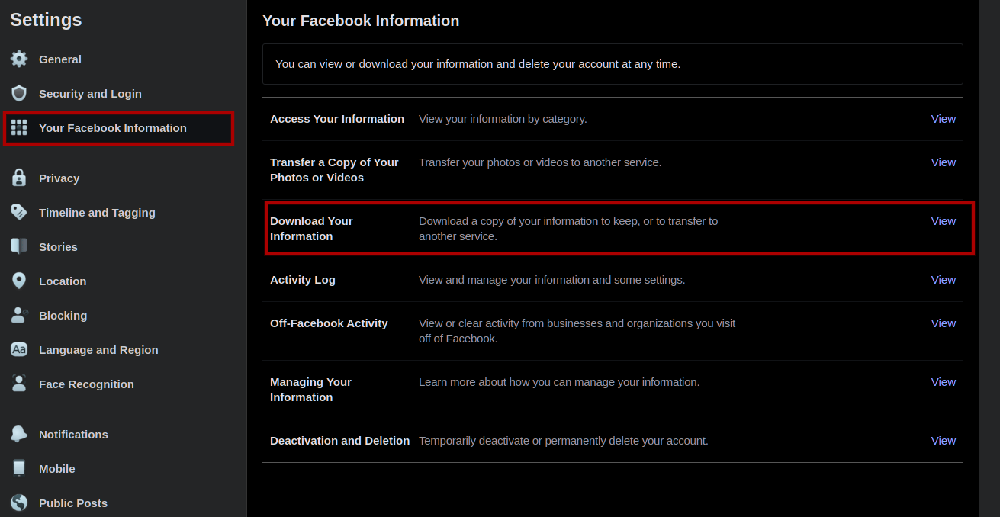
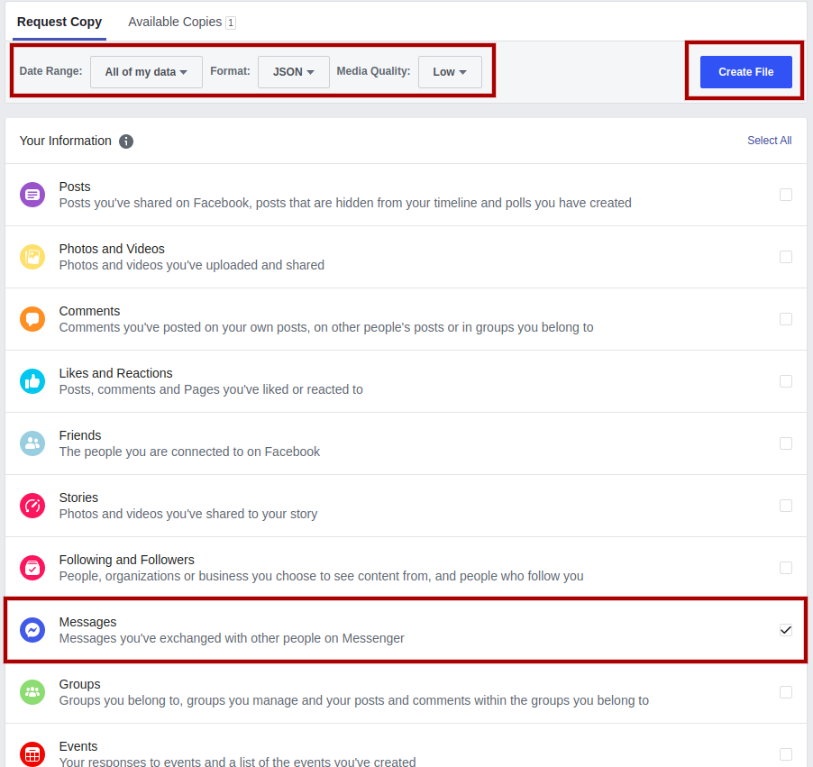

# Introduction
`messenger-dataviz` is a simple project, allowing to analyse Messenger conversation and extract statistics from them. **This is a really simple project, and I have no intention of either deploying it or maintaining it.**

# How to Use
## Download your Messenger conversations
In order to analyse your Messenger statistics, you first need to download your conversations history. To do so, you need to log in to Facebook and go to **Settings and Privacy > Settings**. On your global settings page, go to **Your Facebook Information > Download Your Information**.



On the next page, since you only need your Messenger data, unselect everything except **Messages**. On the top bar, select the range of your data, the **JSON** format and the lowest media quality since you don't need media. Finally, click on **Create File**.



It takes some time for Facebook to generated your JSON file, and you will recevie a Facebook notification when your file is ready. In the example shown above, Facebook took around 3h to generate my file, and the file was around 3.5 GB.

The downloaded ZIP file strcture should be as followed :

```
└── facebook-[YOUR_FACEBOOK_ID]/                 
    ├── archived_threads/
    ├── filtered_threads/
    ├── message_requests/
    ├── stickers_used/
    └── inbox/
```

Inside the **inbox** directory, you will find two directories for each Messenger conversation you have. One contains the media of the conversation (photos, videos, audio, stickers...), and the other contains your messages. The messages are stored in JSON files with the following format :

```
└── [CONVERSATION_ID]/                 
    ├── message_1.json/
    ├── message_2.json/
    ├── message_3.json/
    ├── message_4.json/
    └── ...
```

Each JSON file can store at most 10000 Facebook messages, so you can have multiple JSON files for a single conversation. The directory shown above will be called **your input directory** in this README.

## Analyse Your Data
To analyze your data, run the following command :

> `node analyse.js INPUT_DIR OUTPUT_DIR LAST_INDEX`

With :

- `INPUT_DIR` being the relative path to your input directory
- `OUTPUT_DIR` being the relative path to the output directory
- `LAST_INDEX` the number of messages_X.json files to process

Once, to script is done analysing your conversation data, it will output an `output.json` file in the output directory containing the pre-processed data.

## Process Your Data
You can then process the `output.json` file in order to generate multiple *.CSV files that allows you to visualize your data more easily inside a CSV reader, like Google Docs or Excel.

To do so, run the following command :

> `node process.js OUTPUT_DIR`

With :

- `OUTPUT_DIR` being the relative path to the output directory you gave to the `analyse.js` script

One the script is done processing the data, it will generate multiple *.CSV files in the output directory containing the processed data.
